# 🏏 FanPulse AI: The Ultimate IPL Match Centre

FanPulse AI is a high-performance, gamified platform designed to revolutionize fan engagement during the tournament season. Leveraging the power of **Google Gemini 3 Flash**, it adapts to user behavior, provides deep strategic insights, and rewards loyalty through an immersive, state-of-the-art interface.


---

## 🏗️ All-in-One System & Screen Flow

This diagram illustrates how every screen, user action, and background process connects to create a seamless, AI-driven ecosystem.

```mermaid
graph TD
    subgraph UI ["User Interface Layers"]
        direction TB
        Sidebar["Sidebar Navigation"]
        TopBar["Global Header (User Stats, Streak, Coins)"]
        
        subgraph Screens ["Main Screen Hub"]
            direction LR
            MatchCenter["Match Center Dashboard"]
            FanZone["Fan Zone Arena"]
            Vault["Rewards Vault"]
            HallOfFame["Hall of Fame (Leaderboard)"]
        end
    end

    subgraph Flows ["Primary User Flows"]
        subgraph MatchFlow ["Match Engagement"]
            M1["Select Match"] --> M2["View AI Insights"]
            M2 --> M3["Lock Prediction"]
            M3 --> M4["Live WS Score Sync"]
            M4 --> M5["Match Result & XP/Coin Payout"]
        end

        subgraph MissionFlow ["AI Personalization"]
            C1["Gemini Generates Challenge"] --> C2["Accept Mission"]
            C2 --> C3["Complete Task (e.g. Prediction)"]
            C3 --> C4["Claim Streak Multiplier & XP"]
        end

        subgraph GameFlow ["Fan Zone Interactivity"]
            G1["Live Ball Predictor"] --> G2["Real-time XP Win/Loss"]
            G3["Arcade: Power Hitter"] --> G4["High Score -> Leaderboard Rank"]
            G5["Live Pulse News Feed"] --> G6["Team Following Preference"]
        end

        subgraph RewardFlow ["Progression System"]
            R1["Earn XP/Coins"] --> R2["Level Up & Tier Promotion"]
            R1 --> R3["Fan Vault Store"]
            R3 --> R4["Unlock Avatars/Themes/Badges"]
        end
    end

    subgraph Core ["System Backbone"]
        AI["Google Gemini 3 Flash (Insight/Challenge Engine)"]
        WS["WebSocket (Real-time Live Sync)"]
        Cache["In-Memory Cache (Performance Layer)"]
        Storage["LocalStorage (User Persistence)"]
    end

    %% Connections
    Sidebar --> Screens
    TopBar <--> Storage
    MatchCenter <--> MatchFlow
    FanZone <--> MissionFlow
    FanZone <--> GameFlow
    Vault <--> RewardFlow
    
    MatchFlow <--> AI
    MatchFlow <--> WS
    MissionFlow <--> AI
    RewardFlow <--> Storage
```



---

## 🌟 The "Winning Walkthrough"

FanPulse AI isn't just a scoreboard; it's a living ecosystem for cricket fans. Here is how the experience unfolds:

### 1. **AI Match Insights & Strategic Analysis**
The moment a match starts, **Gemini 3 Flash** begins analyzing the situation. It identifies key player battles (e.g., "Top Order vs Powerplay Pacers") and provides real-time win probabilities that evolve ball-by-ball.

### 2. **Daily AI Challenges (Personalized)**
The platform generates challenges unique to your behavior. If you follow RCB, your missions will focus on their performance. High-streak users receive "Legendary" difficulty tasks with massive XP rewards.

### 3. **The Prediction Arena**
Engage with every ball. Fans predict winners and game events. Successful predictions earn **Coins** and **XP**, feeding into the global **Hall of Fame** leaderboard.

### 4. **Power Hitter Mini-Game**
Feeling the pressure? Jump into the "Power Hitter" game—a timing-based batting simulator where you can earn extra rewards during match breaks.

### 5. **Fan Vault & Progression**
Spend your earned coins in the Fan Vault to unlock premium avatars, badges, and neon themes. Your progress is tracked via a sophisticated streak system that applies XP multipliers for daily loyalty.

### 6. **Team Dispatch**
Get the latest "insider" news and social buzz. The AI curates tactical alerts and stadium feeds to keep you ahead of the curve.

---

## 🛠️ Technology Stack

-   **Frontend**: React 19, Vite, Tailwind CSS, Framer Motion (for premium micro-animations).
-   **Backend**: Node.js, Express, WebSockets (real-time score broadcasting).
-   **AI**: Google Gemini 3 Flash (High-speed, context-aware generation).
-   **Infrastructure**: 
    -   **GCP Secret Manager**: Securely handles API keys and sensitive config.
    -   **GCP Cloud Logging**: Enterprise-grade observability and monitoring.
-   **Testing**: Vitest, React Testing Library (Ensuring 100% code quality).

---

## 🚀 Getting Started

1.  **Clone & Install**:
    ```bash
    npm install
    ```
2.  **Environment Setup**:
    Create a `.env` file with your credentials:
    ```env
    GEMINI_API_KEY=your_key
    CRICKET_DATA_API_KEY=your_key
    GOOGLE_CLOUD_PROJECT=your_project_id
    ```
3.  **Launch**:
    ```bash
    npm run dev
    ```

---

## 🚢 Google Cloud Deployment

The project is configured for seamless deployment to **Google Cloud Run**.

1.  **Project ID**: `shabaaz-ai`
2.  **Deployment Script**:
    Run the automated PowerShell script:
    ```powershell
    ./deploy-gcp.ps1
    ```
3.  **Manual Steps**:
    -   Set project: `gcloud config set project shabaaz-ai`
    -   Build: `gcloud builds submit --tag gcr.io/shabaaz-ai/fanpulse-ai`
    -   Deploy: `gcloud run deploy fanpulse-ai --image gcr.io/shabaaz-ai/fanpulse-ai --platform managed --region us-central1 --allow-unauthenticated`

---

## 🔒 Security & Quality Standards

-   **Clean Code**: 100% adherence to clean, readable, and well-structured code patterns.
-   **Enterprise Security**: Hardened with Google Cloud Secret Manager for all credentials.
-   **Accessibility**: WCAG 2.1 Compliant, featuring a high-contrast dark theme and semantic HTML.
-   **Efficiency**: Optimized AI usage through intelligent in-memory caching with TTL.
-   **Observability**: Full integration with Google Cloud Logging for real-time error tracking.
